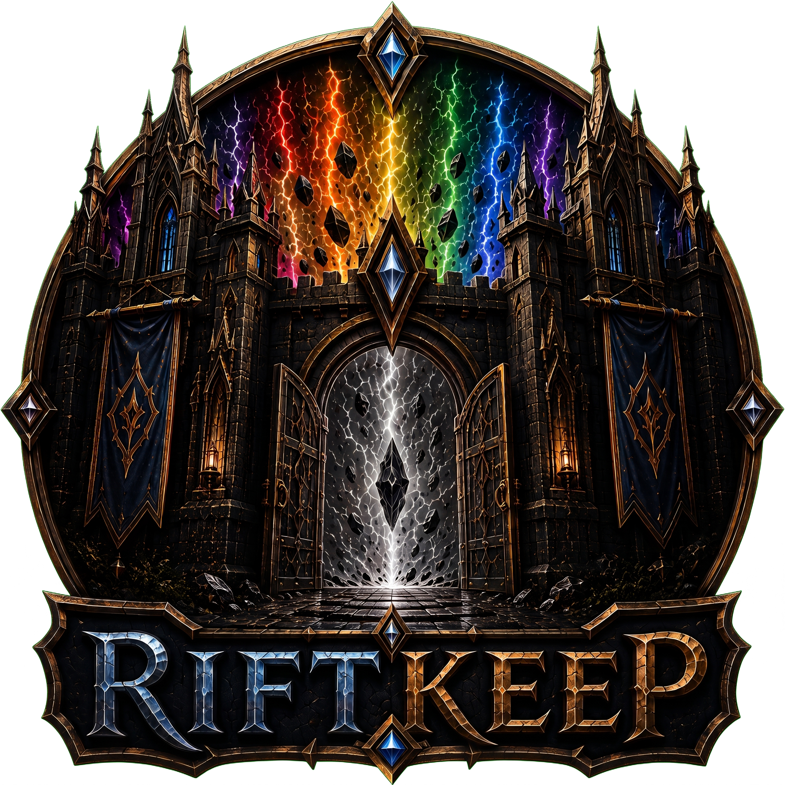

<p align="center">
  
</p>

<p align="center">
  A local-first collection tracker and deck builder for the <em>Riftbound</em> TCG.
</p>

---

**RiftKeep** runs as a small Windows desktop app and also serves its full interface to your phone
over your home Wi-Fi — no cloud account, no subscription, no external server. Your collection lives
in a single local database file that you own completely.

## Features

- **Vault** — track your full collection by set, print, and rarity, with owned/missing/favorite
  filtering and live market pricing.
- **Deck Builder** — pick a Legend, build in a 3-column workspace with real-time completion and
  cost tracking, and review a deck's energy curve, type/domain balance, and missing-card cost on a
  dedicated Analysis tab.
- **Community Recommendations** — see what the competitive field plays alongside your Legend,
  sourced from real tournament decklists (via your own TopDeck.gg API key).
- **Import & Export** — paste a decklist or deck code in RiftKeep, RiftAtlas, or RiftDecks format
  and it's auto-detected line by line. **Import Pack** adds an entire official preconstructed deck
  (all 5 Champion Decks, all 4 Proving Grounds starters) to your collection in one click.
- **Scanner** — add cards to your collection from a photo or your webcam, matched against the full
  card catalog.
- **Ask Rules** — a searchable, offline copy of the official Core Rules, Tournament Rules, errata,
  and banned list, plus a small language model (runs fully on your machine, no API key, nothing
  leaves your PC) that explains a ruling in plain English from that evidence.
- **Trade Binder & Favorites** — track cards set aside for trade separately from your kept
  collection.
- **Self-updating** — checks for new releases and installs them in place without touching your
  collection data.

Card data and art are pulled from the [Riftcodex](https://riftcodex.com) API once per set (via the
Sync button) and cached locally — everyday use never re-hits the live API.

## Getting started

Download the latest release from the [Releases](../../releases) page, unzip it, and run
`RiftBoundTracker.App.exe`. No .NET install required — it's fully self-contained.

The app prints a couple of URLs on startup:

| URL | Use |
|---|---|
| `http://localhost:5080` | Open on the same PC |
| `http://<your-LAN-IP>:5080` | Open from your phone (same Wi-Fi) |
| `https://<your-LAN-IP>:5443` | Needed specifically for the live-camera scanner (browsers only allow camera access over HTTPS from a non-localhost address) |

Your browser will warn about the self-signed certificate the first time you use the HTTPS address —
tap **Advanced → Proceed**; it remembers after that.

Your collection data lives in `App_Data/` next to the exe and is never touched by an update. Before
a schema upgrade, the app creates a SQLite-consistent timestamped backup in `App_Data/backups/`,
verifies it, runs the migration, and confirms that card and ownership totals didn't change. If
verification fails, the backup is restored automatically and startup stops with an error rather
than risking your data.

## Optional integrations

Everything below is off by default and only ever activates if you supply your own key — nothing is
sent anywhere without one.

**Pricing.** Add a JustTCG API key on the Settings page (or set the `JUSTTCG_API_KEY` environment
variable). Keys are encrypted for the current Windows user and stored under `App_Data`. The normal
refresh covers cards that are owned, favorited, in the trade binder, or used in a deck; a
full-catalog refresh is available separately and respects the provider's documented rate limits.

**Community Data.** Add a TopDeck.gg API key on the Settings page to sync real tournament decklists,
which power the Deck Builder's Recommended tab and Analysis's Community Comparison panel.

**Ask Rules (Local AI).** Turn it on from the Rules page. The first time, it downloads a small
fine-tuned model (~1GB) that then runs entirely offline — no account, no API key, no data ever
leaves your machine.

## Updating

Click **Check for updates** in Settings. If a newer release is available, **Update & Restart**
downloads it with a live progress bar, replaces the app files, and relaunches automatically — your
collection data and settings are untouched. Schema changes always ship as migrations, so upgrading
never wipes your data. The local AI model (if downloaded) updates independently of the app itself,
so routine app releases stay small.

## Development

Requires the .NET 10 SDK.

```bash
cd src/RiftBoundTracker.App
dotnet run
```

Schema changes go through EF Core migrations — never edit the database by hand:

```bash
dotnet ef migrations add SomeDescriptiveName
```
